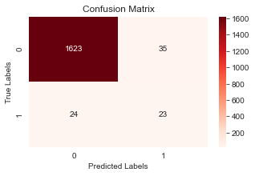

# Taichung Commercial Bank - Loan Approval Analysis

Author: Simran Kaur 


## Problem

Taichung Commercial Bank ("TCB") is a commercial bank in Taiwan and it was estabished in 1953. One of the services they offer is commercial loans to companies. Underwriters assess the financials of a company to determine if a loan should be granted. This process is quite strenuous as many factors go into the review. 

TCB has reached out to understand the most important variables when granting loans. They want to see if the process can be shorted/streamlined. 

## Data

Data was taken from [kaggle.com](https://www.kaggle.com/datasets/fedesoriano/company-bankruptcy-prediction). It has financial information on 6,800 companies and if they declared bankruptcy between 1999 and 2009. As per the report, company bankruptcy is defined based on the business regulations of the Taiwan Stock Exchange.

This data will be helpful in understanding what factors are indicators a company will go bankrupt and what factors TCB should prioritize.

## Methods

This project was broken into three parts - EDA, modeling I and modeling II. 

In the first part, EDA was completed. Highly correlated features were dropped and SMOTE was applied to the class imbalance to the "Bankrupt?" variable. 

The second part was the first half of modeling. Five different algorithms were ran. F!-Score was used as the performance metric in this case as it works best for imbalanced datasets. 

The third part further analyzed the chosen model to understand why the model performed as it did. This was done by plotting SHAP values and permutation importances. Hypterparameter tuning was applied to the model as well however, it did not increase performance. 

## Results

The original Random Forest Classifier model was the best performing model as it had the highest F1-Score. Confusion matrix for the model below:



## Suggestions

**Seperate clients into Red, Amber and Green buckets.** These buckets would be the result of an initial financial analysis and it would be based on if the client has a good financial standing in the top 10 features.
* The "Red" bucket will be clients who have not met the thresholds for the top 10 features and therefore would immediately be rejected.
* The "Amber" bucket applies to clients who may not meet all of the top 10 features and therefore require some further work.
* The "Green" bucket applies to clients who have meet all of the top 10 features as those hold the most weight in the model.

**Review client history.** It would be insightful to understand how the client has performed over the last 10 years. This initial test will show the trajectory the client has been on and may raise red flags, if any.

## Next Steps


## Further Information

See the full analysis in the [Jupyter Notebook](https://github.com/simrank3/TCB_Loan_Approval_Process/blob/main/notebook.ipynb) or review the [presentation](https://github.com/simrank3/TCB_Loan_Approval_Process/blob/main/presentation.pdf).

For additional information, contact Simran Kaur at simran.kaur@flatironschool.com

## Repository Structure
```
├── data
│   ├── company-bankruptcy-prediction.zip
│   ├── data.csv
├── images
│   ├── cm_rf.jpeg
│   ├── tcb_logo.jpeg
├── notebook.ipynb
├── presentation.pdf
└── README.md